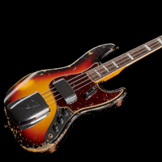
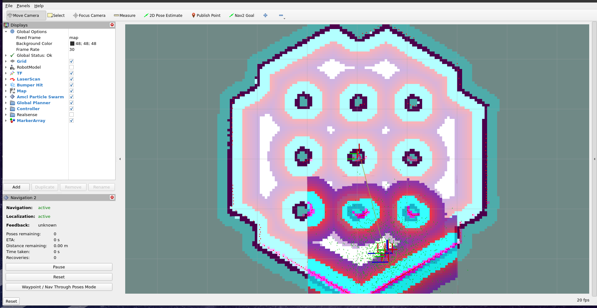

---
jupytext:
  formats: md:myst
  text_representation:
    extension: .md
    format_name: myst
kernelspec:
  display_name: Python 3
  language: python
  name: python3
---

# Beispiel


## AMCL and Navigation

in diesem Beispiel wird eine Turtlebot Simulation gestartet. Dabei ist die Map bekannt. Mittels AMCL wird der Turtlebot lokalisiert.

### Starten der Simulation

Beovr die Simulation gestartet werden kann, muss die `setup.bash` gesourced werden und einige Umgebungsvariablen gesetzt werden. 

```bash
source /opt/ros/<ros2-distro>/setup.bash
export TURTLEBOT3_MODEL=waffle
export GAZEBO_MODEL_PATH=$GAZEBO_MODEL_PATH:/opt/ros/<ros2-distro>/share/turtlebot3_gazebo/models
```

nun kann die Simulation mit folgendem Befehl gestartet werden:

```bash
ros2 launch nav2_bringup tb3_simulation_launch.py headless:=False
```

Es sollten die Programme rviz und gazebo starten. Folgendes sollte in rviz zu sehen sein:




Nun kann die lokalisation gestartet werden. Klicke hierführ auf `2D Pose Estimate`, klick auf die Map in rviz, wo du den Turtlebot vermutest und ziehe den Pfeil in die vermutete Richtung. Es sollte folgendes zu sehen sein:



### Navigation

Um den Roboter zu bewegen. Klicke auf Nav Goal und klicke auf die gewünschte Position auf der Map. Der Pfeil verwendet werden, um die Zielorientierung des Turtlebots festzulegen.


Man sollte nun erkennen, dass sich der Roboter bewegt:


## SLAM

um ein SLAM Simulation zu starten muss zunächst die Ros Umgebung gesetzt werden:

```
source /opt/ros/<ros2-distro>/setup.bash
export TURTLEBOT3_MODEL=waffle
```


Nun kann die Simulation mit folgendem Befehl gestartet werden:

```
ros2 launch nav2_bringup tb3_simulation_launch.py slam:=True
```


