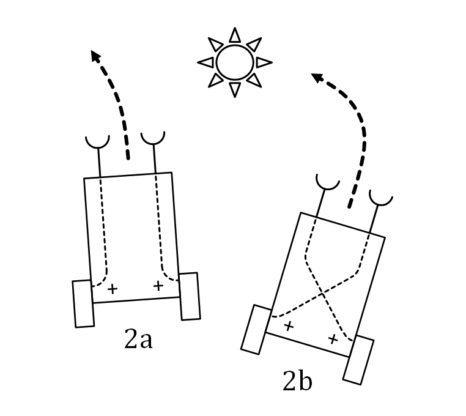

# Aufgabe

## Braitenberg Vehicles

Ziel dieser Übung ist es sich mit ros2 *topics* vertraut zu machen. Dies geschieht am Beispiel der sog. *Braitenberg Vehicles*.

Ein Breitenberg Vehicle ist ein einfacher Roboter, der sich autonom bewegen kann. Er ist ausgestattet mit Sensoren, um Umwelteinflüsse wahrzunehmen. Diese Sensoren sind mit Motoren verbunden, die die Bewegung des Roboters steuern. Die Bewegung des Roboters wird durch einfache Regeln gesteuert, die auf den Sensorwerten basieren.

## Umgebung

In dieser Übung erhalten Sie einen ros2 workspace, der das *package* mit dem namen *braitenberg* enthält. Bauen Sie das package mit `colcon` und launchen Sie die `vehicle.launch.py` datei.

Es sollte sich eine gazebo Simulation starten, welche ein simples Fahrzeug simuliert. Dieses Fahrzeug besitzt zwei Kameras, die die Umgebung wahrnehmen. Wenn Sie die Simulation starten, indem Sie auf den play Button in gazebo klicken, können Sie die aufgezeichneten Bilder der Kameras sehen.

Es existieren ebenfalls zwei *topics*, die die lichtintensität der Kameras wiedergeben. Diese *topics* sind `/light_intensity0` und `/light_intensity1`.

## Aufgabe

Ihre Aufgabe ist es, ein Braitenberg Vehicle umzusetzen. 

- Verkoppeln Sie hierzu analog zu dem Bild unten die Licht Sensoren mit dem Antrieb. Zur steuerung des Antriebs kann der `/cmd_vel` *topic* verwendet werden.

- Erstellen Sie mindestens 2 Varianten, die ein unterschiedliches Verhalten des Roboters zur Lichtquelle bewirken.

- Fügen Sie die implementierten Nodes in das `vehicle.launch.py` file ein. Die Variante sollte über einen Paramter gesteuert werden können.

## Abgabe

Laden Sie den fertigen ausführbaren Workspace im Learnweb als `.zip` hoch.




## Antrieb Steuerung Beispiel

Starten Sie die gazebo Simulation und führen Sie folgenden Befehl in Ihrem Terminal aus. 

```
ros2 topic pub --once /cmd_vel geometry_msgs/msg/Twist "{linear: {x: 2.0, y: 0.0, z: 0.0}, angular: {x: 0.0, y: 0.0, z: 1.8}}"
```

Das Fahrzeug sollte nun eine Rechtskurve beschreiben.


